# Music Roadtrip Calendar Ingest Flowchart

Audience: marketing, leadership, partners, and non-technical stakeholders.

This document shows how Music Roadtrip turns approved calendar sources and
provider data into clean, app-ready concert and venue information. Public
submissions do not auto-publish, and Concert/Event records remain events. They
are never treated as POIs.

## Page 1: Music Roadtrip Calendar Ingest — Current Workflow

```mermaid
%%{init: {"theme": "dark", "themeVariables": {"background": "#0b1014", "primaryColor": "#182126", "primaryTextColor": "#f4f7f2", "primaryBorderColor": "#31d17c", "lineColor": "#f5b841", "secondaryColor": "#24313a", "tertiaryColor": "#111820", "fontFamily": "Inter, Arial, sans-serif"}}}%%
flowchart LR
    A["Public Submissions"] --> B["Admin Review"]
    B --> C["Master Calendar Source Registry"]
    C --> D["Crawl Queue"]
    D --> E["Source Extraction"]
    E --> F["Source Intelligence"]
    F --> G["Event Cleanup"]
    G --> H["Ticket + Photo QA"]
    H --> I["POI Matching / POI Candidates"]
    I --> J["Preview + App Feed"]
```

| Step | What It Means |
| --- | --- |
| Public Submissions | Venues, partners, tourism boards, and internal staff can submit concert calendars or event files for review. |
| Admin Review | Scott or an admin checks the submission, risk signals, permission, and fit before anything is allowed into the workflow. |
| Master Calendar Source Registry | Approved calendars are saved in one deduped source list so Music Roadtrip knows which calendars are trusted and how often to revisit them. |
| Crawl Queue | Approved sources are placed into a controlled queue so crawls happen intentionally, not automatically from public submissions. |
| Source Extraction | The system reads approved calendar pages or files and pulls out possible Concert/Event information for review. |
| Source Intelligence | Each approved calendar remembers what worked, including the scrape method, source health, event yield, and developer notes. |
| Event Cleanup | Events are normalized, deduped, checked against source claims, and cleaned into a consistent Music Roadtrip event format. |
| Ticket + Photo QA | Ticket links, event photos, provider images, and photo rescue results are reviewed before events become app-ready. |
| POI Matching / POI Candidates | Venues are matched to existing Music Roadtrip places or staged as POI candidates for audit before they enter the POI registry. |
| Preview + App Feed | The app team receives clean app-ready data feeds, not raw crawl pages, raw uploads, or unreviewed provider records. |

### Current Workflow Guardrails

- Public submissions do not auto-publish and do not automatically become crawlable.
- Admin approval controls what gets scraped.
- Concert/Event records remain events and are never POIs.
- Venues and places are matched to existing POIs or staged as POI candidates for review.
- App-facing feeds are built from reviewed, cleaned, deduped, and QA-checked data.

## Page 2: Music Roadtrip Calendar Ingest — Cloud Implementation Workflow

```mermaid
%%{init: {"theme": "dark", "themeVariables": {"background": "#0b1014", "primaryColor": "#182126", "primaryTextColor": "#f4f7f2", "primaryBorderColor": "#31d17c", "lineColor": "#39a7ff", "secondaryColor": "#24313a", "tertiaryColor": "#111820", "fontFamily": "Inter, Arial, sans-serif"}}}%%
flowchart LR
    A["Public Submit Pages"] --> B["Cloud Security Layer"]
    B --> C["Calendar Ingest Backend"]
    C --> D["Production Database"]
    D --> E["Worker + Scheduler"]
    E --> F["Event + POI Quality Pipeline"]
    F --> G["Clean App-Ready Feeds"]
    G --> H["Music Roadtrip App Stack"]
```

| Step | What It Means |
| --- | --- |
| Public Submit Pages | Partners and approved submitters use Music Roadtrip-branded forms to send calendar URLs, event files, or source lists. |
| Cloud Security Layer | Public forms, uploads, admin access, and crawlers are protected before requests reach the core system. |
| Calendar Ingest Backend | The private backend manages review, approvals, source registry records, crawls, extraction, and QA workflows. |
| Production Database | Approved sources, crawl history, cleaned events, POI candidates, quality signals, and provenance are stored safely. |
| Worker + Scheduler | Background workers run approved crawls, recurring jobs, source snapshots, and quality checks on controlled schedules. |
| Event + POI Quality Pipeline | Events are deduped, tickets and photos are checked, and venues are matched or staged for POI audit. |
| Clean App-Ready Feeds | The system publishes reviewed JSON feeds for events, venues, POIs, filters, map markers, and quality-safe previews. |
| Music Roadtrip App Stack | The app team consumes clean Music Roadtrip data contracts instead of raw crawl results or raw provider payloads. |

### Cloud Implementation Guardrails

- The cloud system keeps public intake, admin review, crawling, and app feeds separated.
- Approved calendars go into a master source registry before they can be crawled.
- The system remembers how each approved calendar was scraped so future crawls start smarter.
- Security controls protect public forms, uploads, admin sessions, crawler behavior, and private feeds.
- Clean app-ready data is the handoff point; raw source data stays inside the review pipeline.
